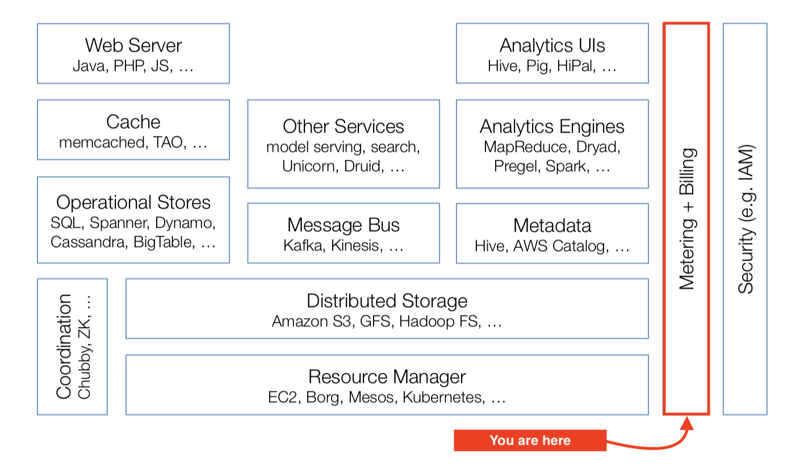

# Awesome Billing and Payments

In a [Cloud computing overview Standford class](http://web.stanford.edu/class/cs349d/docs/L01_overview.pdf), the cloud software stack is presented as such:

This knowledge base cover the far right perimeter of the cloud stack.

## Invoice

## Receipt

* [The humble receipt gets a brilliant redesign](https://www.fastcompany.com/90347782/the-humble-receipt-gets-a-brilliant-redesign) - When a Netflix data engineer revisit receipts.
* [The long, long history of long, long CVS receipts](https://www.vox.com/the-goods/2018/10/10/17956950/why-are-cvs-pharmacy-receipts-so-long)

## Payments

* [Monzo's bank transfers post-mortem](https://monzo.com/blog/2019/06/20/why-bank-transfers-failed-on-30th-may-2019/) - Or why you should be prepared for and work around gateway provider outages.

## Credit Cards

* ['Is that even legal?': Companies may be sharing new credit or debit card information without you knowing](https://www.cbc.ca/news/business/banking-information-shared-with-third-parties-1.5102931) - Some credit and debit card companies have "updating service" that allows new account numbers and expiry dates to be shared with merchants. Visa's implementation is called [VAU](https://developer.visa.com/capabilities/vau) and Mastercard's is [ABU](https://developer.mastercard.com/product/automatic-billing-updater).
* [Strong Customer Authentication](https://stripe.com/guides/strong-customer-authentication) - [Payment Services Directive](https://en.wikipedia.org/wiki/Payment_Services_Directive) 2, explained.

## Fraud

* [How Candy Japan got credit card fraud somewhat under control](https://www.candyjapan.com/behind-the-scenes/how-i-got-credit-card-fraud-somewhat-under-control) - Suggestions involved either [warning signals](https://www.candyjapan.com/behind-the-scenes/fraudulent-transaction-warning-signs) for trying to guess which orders might be fraud, or countermeasures to try to make things harder for the fraudsters.
* [The Secret Trust Scores Companies Use to Judge Us All](https://www.wsj.com/articles/the-secret-trust-scores-companies-use-to-judge-us-all-11554523206) - Nearly everything we buy, how we buy, and where we're buying from is secretly fed into AI-powered verification services that help companies guard against credit-card and other forms of fraud.

## Product Catalog

* [GCP Product Catalog](https://cloud.google.com/blog/products/gcp/introducing-cloud-billing-catalog-api-gcp-pricing-in-real-time)

## Calculator

* [Cloud Cost Calculator](https://github.com/scalyr/cloud-costs) - Web-based tool for finding the cheapest cloud servers for a given set of requirements.
* [Cloud Computing Comparison Engine](https://www.cloudorado.com)
* [EC2Instances.info](https://ec2instances.info) - Easy Amazon EC2 Instance Comparison.

## Cost Forecast

To provide visibility to customers on metered, utility-like billing pricing scheme, having a way to forecast costs is required.

* [GCP Cost Forecast](https://cloudplatform.googleblog.com/2018/07/predict-your-future-costs-with-google-cloud-billing-cost-forecast.html)
* [AWS Forecast product](https://aws.amazon.com/forecast/)

## Cloud Pricing

* [AWS costs every programmer should know](https://david-codes.hatanian.com/2019/06/09/aws-costs-every-programmer-should-now.html)

## Bid/Ask Marketplace

* [EC2 Spot Price Tracker](https://github.com/grosskur/ec2price)
* [Vickrey auction](https://en.wikipedia.org/wiki/Vickrey_auction) - Hinted by an [HN comment](https://news.ycombinator.com/item?id=19145391), in which yes, `"Asking people what they’d pay for and how much rarely works." (...) [but] using a Vickrey auction, similar to Google's ad auction mechanism, can elicit a person's maximum willingness-to-pay.`

## Shopping Cart / Sign-up Tunnel

* [Which has a higher conversion rate: A single long ecommerce checkout form or a multi-step one?](https://capitalandgrowth.org/questions/2055/which-has-a-higher-conversion-rate-a-single-long-e.html) - Focus first on other things in the cart, like easing anxiety and second-guessing by adding reassurance (trust marks, testimonials) near the credit card and completion steps, as well as some guarantee language that you may have used earlier in the product exploration process.

## History

* [The vanished grandeur of accounting](https://www.bostonglobe.com/ideas/2014/06/07/the-vanished-grandeur-accounting/3zcbRBoPDNIryWyNYNMvbO/story.html) - 
Accounting paintings were a significant genre in Dutch art. 

## Others

* https://keygen.sh  - Commercial service to sell and manage license keys
